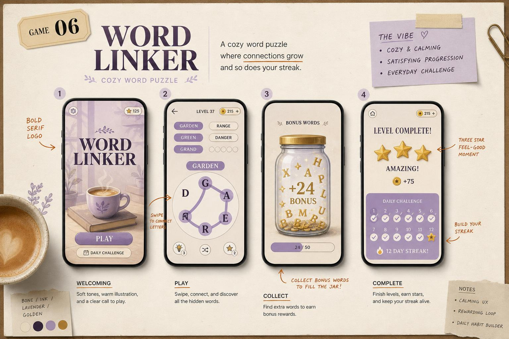

# Word Linker

> **Connect Letters. Find Words.** — körkörös betűkből szavakat húzol; relax-puzzle, kávés-séma.

## Koncepció

A pálya közepén egy **kör alakú betű-paletta** (4–7 betű). A játékos **swipe-pal** szomszédos betűket köt össze egy érvényes szóvá. A felül elhelyezett **szó-lista** (üres kockák hossz szerint) töltődik. Minden talált fő szó coint ad. **Bónusz szavak** (érvényes, de nincs a listában) felgyűlnek egy „extra"-tárolóba, ami kávés-üveggé válik → extra reward. Levelek után nehéz szókombók, daily challenge, téma-csomagok (állatok, ételek, országok).

## Hogyan kell játszani

1. **Drag** szomszédos betűket → szó.
2. Engedd el → ha érvényes (és nem volt még megtalálva), beíródik.
3. **Hint gomb** felfed egy random betűt (10 coin).
4. **Shuffle gomb** átkeveri a betűket (ingyenes).
5. Találd meg az összes fő szót → `LEVEL COMPLETE`.

## Kulcs jellemzők

- 5000+ szint, 25+ téma-pakk.
- Napi **Daily Word** puzzle (különálló leaderboard).
- Hint és Shuffle rendszer.
- 8 nyelven (saját szótárral): EN, ES, PT, FR, DE, IT, HU, TR.
- Cozy minimal art (lavender + pasztell).
- Cloud save.

## Core loop

`Connect → Find Words → Earn → Challenge → Reward → Repeat`

Egy szint 1–3 perc.

## Képernyő-tervek (5 mockup)

| # | Képernyő | Tartalom |
|---|----------|----------|
| 1 | **Main Menu** | Bold „WORD LINKER" logó, `PLAY`, `DAILY`, `THEMES`. |
| 2 | **Gameplay** | Felül: szó-kockák („FRUIT" témanév), középen kör betű-paletta, alul: hint/shuffle/coin. |
| 3 | **Bonus Word** | „+24 BONUS!" felirat, kis pohár-üveg töltődik. |
| 4 | **Level Complete** | 3 csillag, score 1240, coin reward, `NEXT`. |
| 5 | **Daily Reward** | Calendar 7 nap, mai claim. |

## Progresszió és nehézség

- **Betűk száma szinten n:** `B(n) = min(8, 4 + floor(n/15))`.
- **Fő szavak száma:** `W(n) = 3 + floor(n/5)`, hossza nő.
- **Hint ár:** `H = 10 + 5·prev_hints_used_in_level`.
- **DDA:** ha 90s+ áll, automatikus „free hint" felajánlás (rewarded ad).

## Monetizáció

- **Rewarded:** `Free hint`, `Free shuffle`, `2x coin after level`, `Daily wheel spin`.
- **IAP:** Coin pack 0.99–19.99, `Hint pack 1.99 (50 hint)`, `Remove ads 2.99`, `Theme bundle 4.99`.
- **Interstitial:** csak 3 szintenként, capping 60 s.

## Tech specs (MVP)

- React + Canvas / SVG render, line-draw SDF effect.
- Lovable Cloud: szótár-CDN per nyelv, daily seed, leaderboard.
- App méret: < 25 MB (szótár-shardelt).
- Dev idő: 4–6 hét.

## Miért fog sikerülni

- Nyugodt, anti-stressz játékmenet → idősebb női közönség (magas LTV).
- Daily Word → habit-loop.
- Több nyelv natívan → globális reach.
- Alacsony fejlesztési költség (szótár-driven).
- Erős hint-economy → IAP konverzió.

## Célközönség és piacok

- 25–65 év, női skew (~70%), kávézáshoz, várakozáshoz.
- Top piacok: USA, UK, Németország, Brazília, Spanyolország.
- ASO: `word`, `puzzle`, `crossword`, `connect`, `letters`, `brain`.
