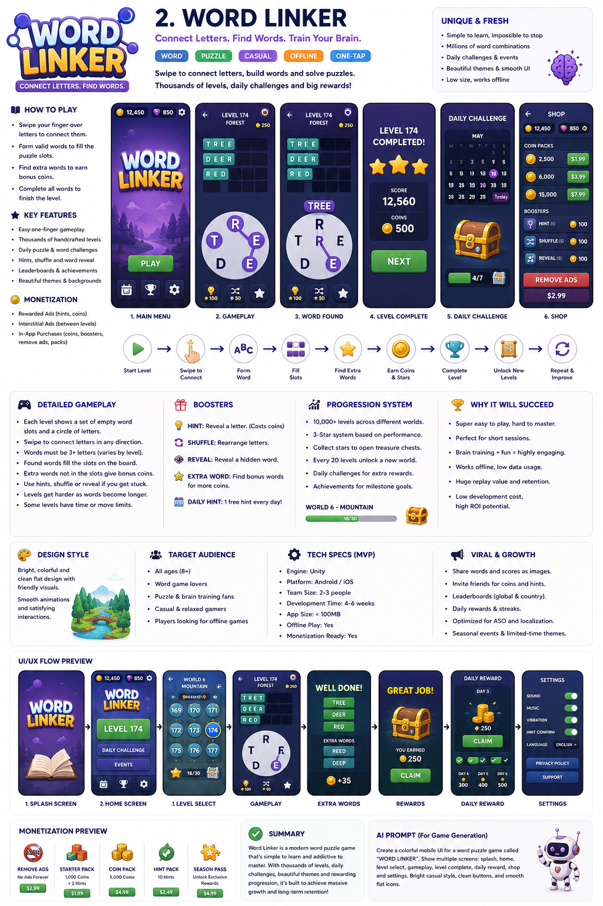

# Word Linker 🟣

> **Connect Letters. Find Words.** — a cozy, anxiety‑free swipe‑to‑connect word puzzle.

Drag across a circle of letters to spell words, fill the grid, and discover bonus
words for extra coins. 150 hand‑graded levels, a soft lavender art style, hints,
shuffles, a bonus jar, coins, stars, and offline‑friendly local saves.



This is the **playable frontend MVP** (Sprints 1–2 of the design plan): the full
core loop, running entirely in the browser with no backend required. See
[Roadmap](#roadmap) for what comes next.

---

## Quick start

```bash
npm install
npm run dev        # start the dev server (Vite)
```

Then open the printed local URL. To produce an optimized build:

```bash
npm run build      # type-check + bundle to dist/
npm run preview    # serve the built bundle
```

## Gameplay

- **Drag** across nearby or distant letters to form a word, then release.
- A valid **grid word** fills its slots and pays `5 + length·2` coins.
- A valid **bonus word** (not on the grid) drops into the jar; every 5 pays out.
- **Hint** reveals a letter (price grows within a level), **Shuffle** is free,
  and **Reveal word** uncovers a whole answer.
- Find every grid word to finish the level and earn up to **3 stars**
  (fewer hints → more stars).

Progress, coins and stars are saved to `localStorage`, so you can close the tab
and pick up where you left off.

## How it’s built

| Layer | Choice |
|-------|--------|
| UI | React 19 + TypeScript + Vite |
| State | Zustand (with `persist` → localStorage) |
| Animation | Framer Motion |
| Drawing | SVG line‑draw for the letter links (crisp, tiny) |
| Audio | Procedural WebAudio (no audio assets) |

### The "no runtime dictionary" trick

Word games normally ship a multi‑megabyte dictionary to validate words. Instead,
**every level pre‑computes its own complete word set at build time** — so the app
ships only a small `levels.json` (~66 KB) and needs no dictionary at runtime.

`scripts/generate-levels.mjs`:

1. picks a recognizable **base word** (from a frequency‑ranked common‑word list),
2. finds **every** valid dictionary word spellable from its letters,
3. splits them into **main** words (the grid — common, length‑varied, scored by a
   commonness+length heuristic) and **bonus** words (the rest),
4. writes a deterministic, reproducible `src/data/levels.json`.

Regenerate the levels with:

```bash
npm run gen:levels
```

### Project layout

```
src/
├── engine/        # pure logic: level data, palette layout math, scoring, audio
├── state/         # Zustand store + per-level play hook
├── components/    # LetterCircle, WordGrid, HintBar, BonusJar, modals, HUD…
├── screens/       # MainMenu, PlayScreen
├── data/          # generated levels.json
└── styles/        # global cozy-lavender theme
scripts/           # build-time level generator + common-words list
```

## Progression formulas

- **Letters per level** `B(n) = min(8, 4 + ⌊n/15⌋)`
- **Grid words per level** `W(n) = min(8, 3 + ⌊n/12⌋)` *(the spec's `3 + ⌊n/5⌋`
  reaches 33 words by level 150 — capped here for a playable grid)*

## Cloud sync (optional)

The game is **local-first** — it’s fully playable with no backend. When Supabase
env vars are present it additionally syncs your save and powers the Daily Word
leaderboard. supabase-js is dynamically imported, so this costs nothing for
offline builds.

```bash
cp .env.example .env.local   # then fill in your project URL + publishable key
```

| Var | Where |
|-----|-------|
| `VITE_SUPABASE_URL` | Supabase → Settings → API |
| `VITE_SUPABASE_ANON_KEY` | the publishable / anon key (safe in client builds) |

**Schema layout.** All tables live in a dedicated **`word_linker`** schema (see
`supabase/migrations/`). The client never touches tables directly — it calls a
small set of `wl_*` `SECURITY DEFINER` functions in `public`
(`wl_load_state`, `wl_save_state`, `wl_submit_daily`, `wl_leaderboard`). This
keeps Word Linker cleanly separable when co-located with other apps in one
project, and works without exposing a custom schema to PostgREST.

**Auth.** Cloud save uses **anonymous sign-in**, so enable
*Authentication → Sign-in → Anonymous sign-ins* on the project. No row is created
until the player actually plays; saves are reconciled with a max-merge so
progress is never lost across devices.

## Roadmap

- Theme packs (Animals, Foods, Countries…), IAP & rewarded-ad hooks
- AI-generated level pipeline and 8-language dictionaries
- Server-validated Daily Word + global tournaments
- Capacitor wrapper for Android/iOS

---

Built with the core loop first: easy to play, hard to put down. ☕
